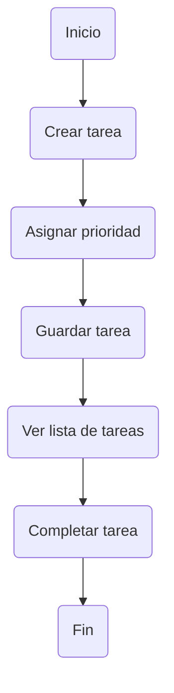

# 📚 Mini-Proyecto 1: Sistema de Gestión de Tareas Académicas

---

## Integrantes y Roles

| Rol            | Nombre              | Responsabilidad |
|----------------|-------------------|----------------|
|   Notetaker   | Diego Gómez        | Registro de información y conclusiones |
|   Moderador   | Luis Contreras     | Coordinación del equipo |
|   Timekeeper  | Alexander Loch     | Control del tiempo |

---

## Objetivo

Desarrollar una propuesta básica para organizar tareas académicas, permitiendo registrar actividades, asignar prioridades y visualizar el progreso.

---

## Problema

Los estudiantes presentan dificultades para gestionar sus tareas académicas, lo que provoca:

- Falta de organización  
- Incumplimiento de fechas  
- Bajo rendimiento académico  

 **Solución:** Diseñar un sistema sencillo de gestión de tareas.

---

##  Funcionalidades

| # | Funcionalidad        | Descripción |
|--|----------------------|------------|
| 1 | Crear tareas        | Agregar nombre, descripción y fecha límite |
| 2 | Prioridad           | Alta, Media, Baja |
| 3 | Completar tareas    | Marcar tareas como finalizadas |
| 4 | Visualización       | Lista de tareas pendientes y completadas |
| 5 | Filtrado (opcional) | Clasificación por prioridad |

---

##  Usuario

-  **Estudiante**
  - Administra sus tareas  
  - Da seguimiento a su progreso  

---
##  Flujo del Sistema

-------------------------------------------------------------------------------------------------------------------------------------------------------------------

# Simulación de Trabajo Remoto

### Registro de Comunicación
- Diego Gómez [Notetaker]: Hola equipo, espero estén pasando una buena tarde. Les hablaba por este medio por un problema que encontré en la aplicación sobre el tiempo que le muestra al usuario. Ya le subí un PR donde especifico los detalles para arreglar el problema.
  
- Alexander Loch [Timekeeper]: Buenas noches a todos, gracias por notificar el problema de la aplicación, por ahora revisando la agenda de algunos compañeros estan ocupados, por lo tanto dejare a Luis para que se pueda encargar de verificar el problema presentado, te pido que hicieras otras pruebas de la aplicación para ver si existe algun otro problema que pueda presentar
  
- luis

- Diego Loch [Timekeeper]: Esta bien luis entendemos tu situación entonces por ahora Diego se encargara de resolver el problema, cuando ya me desocupe con algunos pendientes de producción entonces auxiliare a Diego lo más rapido posible.
---

### Lista de Tareas
- [x] Arreglar el problema mencionado por el compañero 
- [x] Encontrar posibles errores que puedan ocurrir en el futuro
- [x] Definir el tiempo en el que se trabajará el problema
- [x] Designarle una tarea a cada integrante
- [x] Documentar la causa del error

---

### Problema Simulado
La computadora del Timekeeper se reinició por un pantallazo negro.

---

### Solución (Fallback)
- Se redistribuyeron las tareas pendientes entre los miembros activos  
- Se documentaron avances para mantener continuidad  
- Se dejó registro claro de la conversación para que el integrante pueda reincorporarse

---

##  Herramientas Utilizadas
- Google Meet
- Documento de Google Docs donde trabajan los integrantes
- Plataforma de respaldo (Chat de grupo de WhatsApp)

---

## Conclusiones
- La organización del equipo es clave en entornos remotos  
- La comunicación clara evita errores  
- Tener un plan ante problemas mejora la eficiencia del equipo  
  
## [PR-01] Definición del problema y funcionalidades

 Descripción:
 Problema en el manejo del cálculo de tiempos

 Cambios:
 - Cuando debe aparecer la alerta para que el usuario entregue la tarea.
 - Identificar cuando un usuario cambie de zona horaria.

 Justificación:
 Esto va a permitir el correcto funcionamiento del sistema y que no afecte al usuario

 Solicita revisión a:
 Moderador

 Estado:
 Listo para revisión
