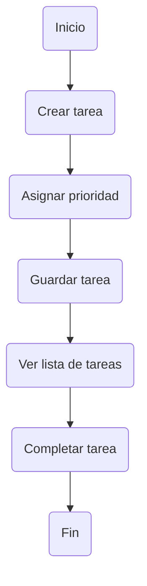

# Mini-Proyecto 1: Sistema de Gestión de Tareas Académicas

---

## Integrantes y Roles

| Rol            | Nombre              | Responsabilidad |
|----------------|-------------------|----------------|
|   Notetaker   | Diego Gómez        | Registro de información y conclusiones |
|   Moderador   | Luis Contreras     | Coordinación del equipo |
|   Timekeeper  | Alexander Loch     | Control del tiempo |

---

## Objetivo

Desarrollar una propuesta básica para organizar tareas académicas, permitiendo registrar actividades, asignar prioridades y visualizar el progreso.

---

## Problema

Los estudiantes presentan dificultades para gestionar sus tareas académicas, lo que provoca:

- Falta de organización  
- Incumplimiento de fechas  
- Bajo rendimiento académico  

 **Solución:** Diseñar un sistema sencillo de gestión de tareas.

---

##  Funcionalidades

| # | Funcionalidad        | Descripción |
|--|----------------------|------------|
| 1 | Crear tareas        | Agregar nombre, descripción y fecha límite |
| 2 | Prioridad           | Alta, Media, Baja |
| 3 | Completar tareas    | Marcar tareas como finalizadas |
| 4 | Visualización       | Lista de tareas pendientes y completadas |
| 5 | Filtrado (opcional) | Clasificación por prioridad |

---

##  Usuario

-  **Estudiante**
  - Administra sus tareas  
  - Da seguimiento a su progreso  

---
##  Flujo del Sistema

-------------------------------------------------------------------------------------------------------------------------------------------------------------------

## Simulación de Trabajo Remoto (Issues & PRs)

---

### Issue #12 - Error en visualización del tiempo

**Estado:** Abierto  
**Prioridad:** Alta  
**Asignado a:** Diego Gómez  

**Descripción:**  
Se detectó un error en la aplicación donde el tiempo mostrado al usuario no coincide con el valor esperado. El problema ocurre bajo ciertas condiciones específicas aún en análisis.

**Pasos para reproducir:**
1. Ingresar a la aplicación  
2. Ejecutar funcionalidad de cálculo de tiempo  
3. Observar el valor mostrado  

**Resultado esperado:**  
El tiempo debe reflejar correctamente el cálculo real.

**Resultado actual:**  
El tiempo mostrado es incorrecto.

---

### Comentarios del Issue

**Diego Gómez (Notetaker):**  
He identificado el bug y ya se encuentra documentado. Procedo a trabajar en una solución y generar un PR.

---

**Alexander Loch (Timekeeper):**  
Gracias por el reporte. Debido a la carga actual, sugiero priorizar este issue. Luis, ¿puedes encargarte de la revisión del PR cuando esté disponible?

---

**Luis Contreras (Moderador):**  
Confirmado. Me encargaré de la revisión del PR y validar la solución propuesta.

---

### Pull Request #27 - Fix: Corrección en cálculo de tiempo

**Estado:** En revisión  
**Autor:** Diego Gómez  
**Revisor:** Luis Contreras  

**Descripción:**  
Se corrige el cálculo del tiempo mostrado al usuario, ajustando la lógica que generaba inconsistencias.

**Cambios realizados:**
- Corrección en la fórmula de cálculo  
- Validación de datos de entrada  
- Mejora en manejo de errores  

---

### Comentarios del PR

**Luis Contreras (Moderador):**  
Revisión inicial completada. La lógica es correcta, pero sugiero optimizar la validación de entradas para evitar posibles errores futuros.

---

**Diego Gómez (Notetaker):**  
Cambios aplicados según sugerencias. Se actualiza el PR para nueva revisión.

---

**Alexander Loch (Timekeeper):**  
Equipo, recordatorio de tiempos:
- 10 min revisión  
- 10 min pruebas  
- 5 min cierre  

Mantengamos el flujo activo.

---

### Issue #13 - Evento: Pérdida de conexión

**Estado:** Resuelto  
**Prioridad:** Media  
**Asignado a:** Equipo  

**Descripción:**  
Durante la revisión del PR, el moderador (Luis) pierde conexión.

---

### Acciones tomadas

- El Timekeeper reasigna temporalmente la revisión  
- El Notetaker continúa documentando avances  
- Se mantiene la continuidad del trabajo  

---

### Resultado

El equipo logró continuar sin interrupciones, aplicando correctamente estrategias de trabajo colaborativo en entornos remotos.

---

### Conclusión

- Se utilizó correctamente el flujo de Issues y PRs  
- Se mantuvo comunicación profesional  
- Se respetaron roles y tiempos  
- Se resolvió el problema de forma eficiente  

---
